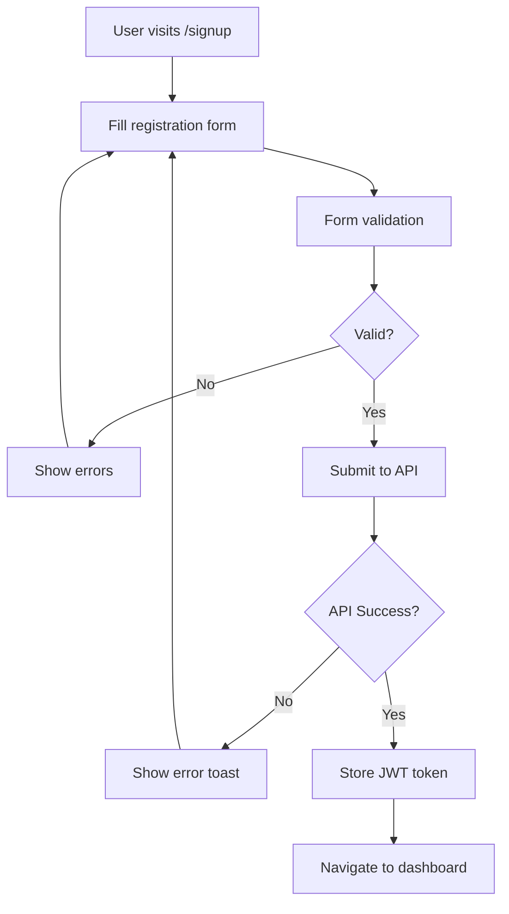
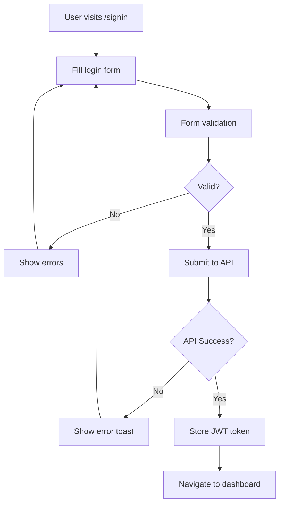
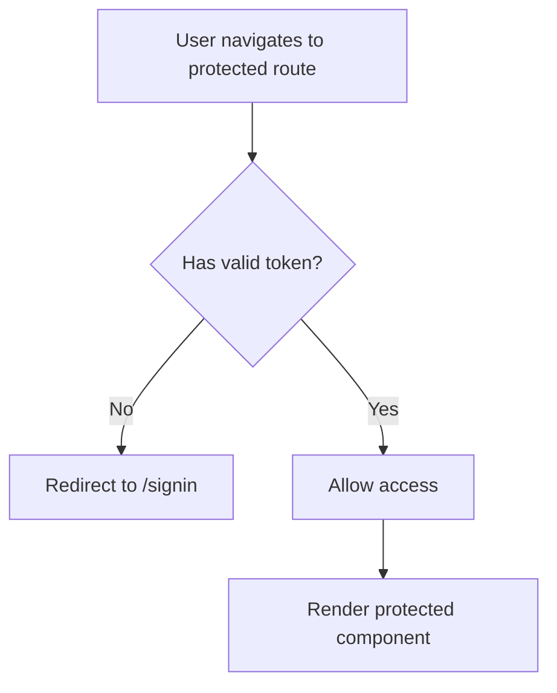

# EasyGen Authentication Frontend

A modern, responsive React frontend application built with TypeScript, Vite, and shadcn/ui components. This frontend provides a beautiful and intuitive user interface for the EasyGen authentication system with real-time validation, modern UI components, and seamless user experience.

## 🚀 Features

### ✨ Modern UI/UX
- **shadcn/ui Components**: Professional, accessible, and customizable components
- **Tailwind CSS**: Utility-first CSS framework for rapid styling
- **Responsive Design**: Mobile-first approach that works on all devices
- **Dark Mode Ready**: Built with shadcn/ui's theming system
- **Gradient Backgrounds**: Modern visual design with smooth gradients

### 🔐 Authentication Features
- **User Registration**: Complete signup flow with validation
- **User Login**: Secure signin with credential validation
- **Protected Routes**: Route protection for authenticated users
- **JWT Token Management**: Automatic token storage and validation
- **Auto Logout**: Automatic logout on token expiration
- **Persistent Sessions**: Remember user across browser sessions

### 📝 Form Handling & Validation
- **React Hook Form**: Performant forms with minimal re-renders
- **Zod Schema Validation**: Type-safe runtime validation
- **Real-time Validation**: Instant feedback on form inputs
- **Error Handling**: Comprehensive error states and messages
- **Loading States**: Visual feedback during API calls

### 🎯 User Experience
- **Toast Notifications**: Real-time feedback with react-hot-toast
- **Loading Indicators**: Smooth loading states for all actions
- **Error Recovery**: User-friendly error handling
- **Intuitive Navigation**: Clear navigation between authentication states

## 🏗️ Architecture

### Project Structure
```
frontend/
├── public/                   # Static assets
│   └── vite.svg
├── src/
│   ├── components/          # React components
│   │   ├── ui/             # shadcn/ui components
│   │   │   ├── button.tsx      # Button component
│   │   │   ├── card.tsx        # Card component
│   │   │   ├── form.tsx        # Form components
│   │   │   ├── input.tsx       # Input component
│   │   │   └── label.tsx       # Label component
│   │   ├── Dashboard.tsx       # Protected dashboard page
│   │   ├── ProtectedRoute.tsx  # Route protection component
│   │   ├── SignIn.tsx          # Login form component
│   │   └── SignUp.tsx          # Registration form component
│   ├── contexts/           # React contexts
│   │   └── AuthContext.tsx     # Authentication state management
│   ├── lib/               # Utility libraries
│   │   └── utils.ts           # shadcn/ui utility functions
│   ├── services/          # API services
│   │   └── api.ts             # API client and endpoints
│   ├── assets/            # Static assets
│   ├── App.tsx            # Main application component
│   ├── main.tsx           # Application entry point
│   └── index.css          # Global styles (Tailwind imports)
├── components.json          # shadcn/ui configuration
├── package.json            # Dependencies and scripts
├── tailwind.config.js      # Tailwind CSS configuration
├── tsconfig.json           # TypeScript configuration
├── vite.config.ts          # Vite configuration
└── README.md              # This file
```

### Technology Stack
- **React 19**: Latest React with improved performance
- **TypeScript**: Type-safe development
- **Vite**: Fast build tool and development server
- **shadcn/ui**: High-quality, accessible component library
- **Tailwind CSS**: Utility-first CSS framework
- **React Router**: Client-side routing
- **React Hook Form**: Performant form library
- **Zod**: Schema validation library
- **Axios**: HTTP client for API requests
- **React Hot Toast**: Toast notification system

## 📋 Prerequisites

- Node.js (v18 or higher)
- pnpm (package manager)
- Backend API running on `http://localhost:3001`

## 🛠️ Installation

1. **Install dependencies:**
   ```bash
   pnpm install
   ```

2. **Environment Setup:**
   The frontend is configured to connect to the backend at `http://localhost:3001`. If your backend runs on a different port, update the `API_BASE_URL` in `src/services/api.ts`.

## 🚀 Running the Application

```bash
# Development mode with hot-reload
pnpm dev

# Build for production
pnpm build

# Preview production build
pnpm preview

# Lint code
pnpm lint
```

The application will be available at:
- **Development**: `http://localhost:5173`
- **Production Preview**: `http://localhost:4173`

## 🎨 UI Components

### Authentication Pages

#### Sign Up Page (`/signup`)
- **Features**: Name, email, and password input with validation
- **Validation**: Real-time validation with comprehensive error messages
- **Design**: Card-based layout with gradient background
- **Navigation**: Link to sign in page for existing users

#### Sign In Page (`/signin`)
- **Features**: Email and password authentication
- **Validation**: Form validation with error feedback
- **Design**: Modern card layout with professional styling
- **Navigation**: Link to sign up page for new users

#### Dashboard Page (`/dashboard`)
- **Features**: Welcome message, user profile information
- **Protection**: Requires authentication to access
- **Design**: Clean card-based layout with user info
- **Actions**: Logout functionality

### UI Component Library

All components use **shadcn/ui** with the **Neutral** color scheme:

- **Button**: Multiple variants (default, destructive, outline, secondary, ghost, link)
- **Card**: Container component with header, content, and footer sections
- **Form**: Comprehensive form components with validation
- **Input**: Styled input fields with focus states
- **Label**: Accessible labels for form fields

## 🔄 Authentication Flow

### 1. User Registration


### 2. User Login


### 3. Protected Route Access


## 🔧 Configuration

### API Configuration (`src/services/api.ts`)
```typescript
const API_BASE_URL = 'http://localhost:3001';

// Axios instance with automatic token attachment
const api = axios.create({
  baseURL: API_BASE_URL,
  headers: {
    'Content-Type': 'application/json',
  },
  timeout: 10000,
});
```

### shadcn/ui Configuration (`components.json`)
```json
{
  "style": "default",
  "rsc": false,
  "tsx": true,
  "tailwind": {
    "config": "tailwind.config.js",
    "css": "src/index.css",
    "baseColor": "neutral",
    "cssVariables": true,
    "prefix": ""
  },
  "aliases": {
    "components": "@/components",
    "utils": "@/lib/utils"
  }
}
```

## 🎯 Form Validation

### Registration Form Validation
```typescript
const signUpSchema = z.object({
  name: z
    .string()
    .min(3, 'Name must be at least 3 characters long')
    .max(100, 'Name must not exceed 100 characters')
    .regex(/^[a-zA-Z\s'-]+$/, 'Name can only contain letters, spaces, hyphens, and apostrophes'),
  email: z
    .string()
    .email('Please provide a valid email address')
    .max(254, 'Email must not exceed 254 characters'),
  password: z
    .string()
    .min(8, 'Password must be at least 8 characters long')
    .max(128, 'Password must not exceed 128 characters')
    .regex(
      /^(?=.*[a-z])(?=.*[A-Z])(?=.*\d)(?=.*[@$!%*#?&])[A-Za-z\d@$!%*#?&]+$/,
      'Password must contain at least one uppercase letter, one lowercase letter, one number, and one special character'
    ),
});
```

### Login Form Validation
```typescript
const signInSchema = z.object({
  email: z
    .string()
    .email('Please provide a valid email address'),
  password: z
    .string()
    .min(1, 'Password is required'),
});
```

## 🛡️ Security Features

### JWT Token Management
- **Automatic Storage**: Tokens stored in localStorage
- **Request Interceptors**: Automatic token attachment to API requests
- **Token Validation**: Automatic logout on invalid/expired tokens
- **Secure Headers**: Proper Authorization header handling

### Route Protection
- **ProtectedRoute Component**: Wrapper for authenticated-only routes
- **Automatic Redirects**: Unauthenticated users redirected to signin
- **State Persistence**: Authentication state maintained across page refreshes

### Input Sanitization
- **Form Validation**: Comprehensive input validation with Zod
- **XSS Prevention**: React's built-in XSS protection
- **Type Safety**: TypeScript for compile-time safety

## 🎨 Customization

### Adding New Components
```bash
# Add new shadcn/ui components
npx shadcn-ui@latest add [component-name]

# Example: Add a new dialog component
npx shadcn-ui@latest add dialog
```

### Customizing Theme
Edit `src/index.css` to customize the design system:
```css
:root {
  --background: 0 0% 100%;
  --foreground: 240 10% 3.9%;
  --primary: 240 5.9% 10%;
  --primary-foreground: 0 0% 98%;
  /* ... other CSS variables */
}
```

## 🧪 Testing

The project is set up for testing with modern React testing practices:

```bash
# Run tests (when implemented)
pnpm test

# Run tests in watch mode
pnpm test:watch

# Generate coverage report
pnpm test:coverage
```

## 🚀 Production Deployment

### Build for Production
```bash
pnpm build
```

### Environment Variables
For production, ensure proper API URL configuration:
```typescript
// Update src/services/api.ts for production
const API_BASE_URL = process.env.VITE_API_URL || 'https://your-api-domain.com';
```

### Deployment Options
- **Vercel**: Zero-config deployment for Vite projects
- **Netlify**: Static site deployment with form handling
- **AWS S3 + CloudFront**: Scalable static hosting
- **Docker**: Containerized deployment

## 🤝 Contributing

1. Fork the repository
2. Create a feature branch (`git checkout -b feature/amazing-feature`)
3. Commit your changes (`git commit -m 'Add amazing feature'`)
4. Push to the branch (`git push origin feature/amazing-feature`)
5. Open a Pull Request


## 🙏 Acknowledgments

- [shadcn/ui](https://ui.shadcn.com/) for the amazing component library
- [Tailwind CSS](https://tailwindcss.com/) for the utility-first CSS framework
- [React Hook Form](https://react-hook-form.com/) for performant form handling
- [Zod](https://zod.dev/) for schema validation
- [Lucide React](https://lucide.dev/) for beautiful icons
